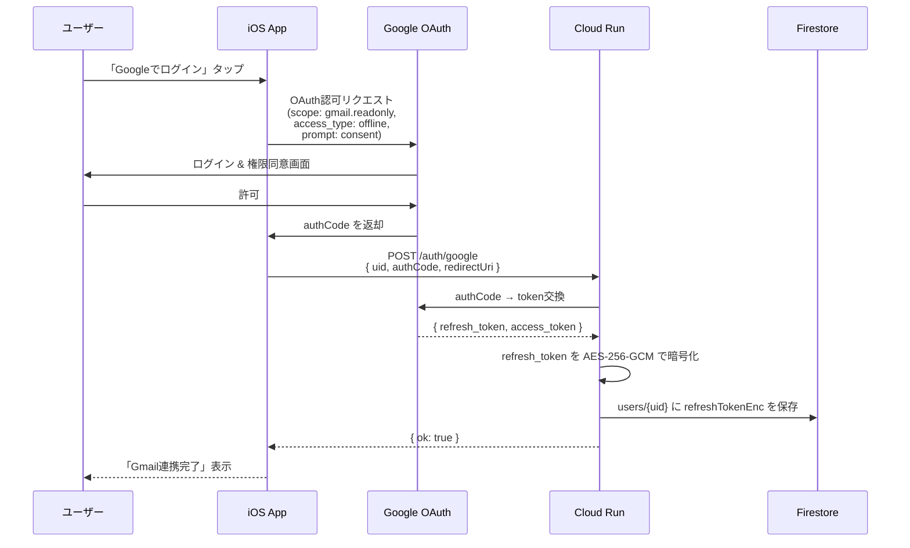
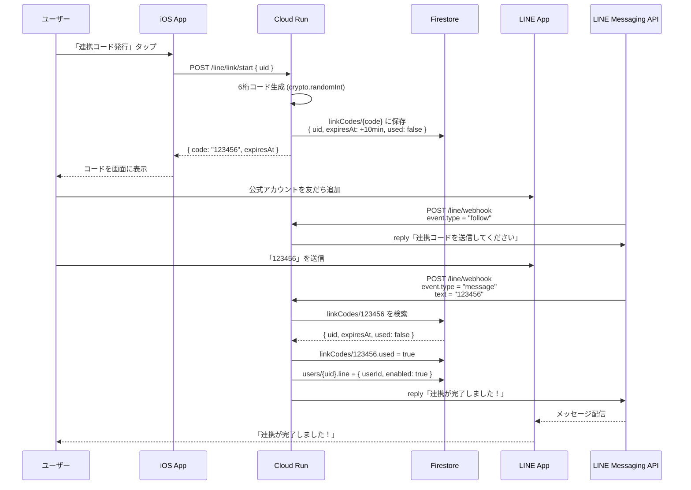
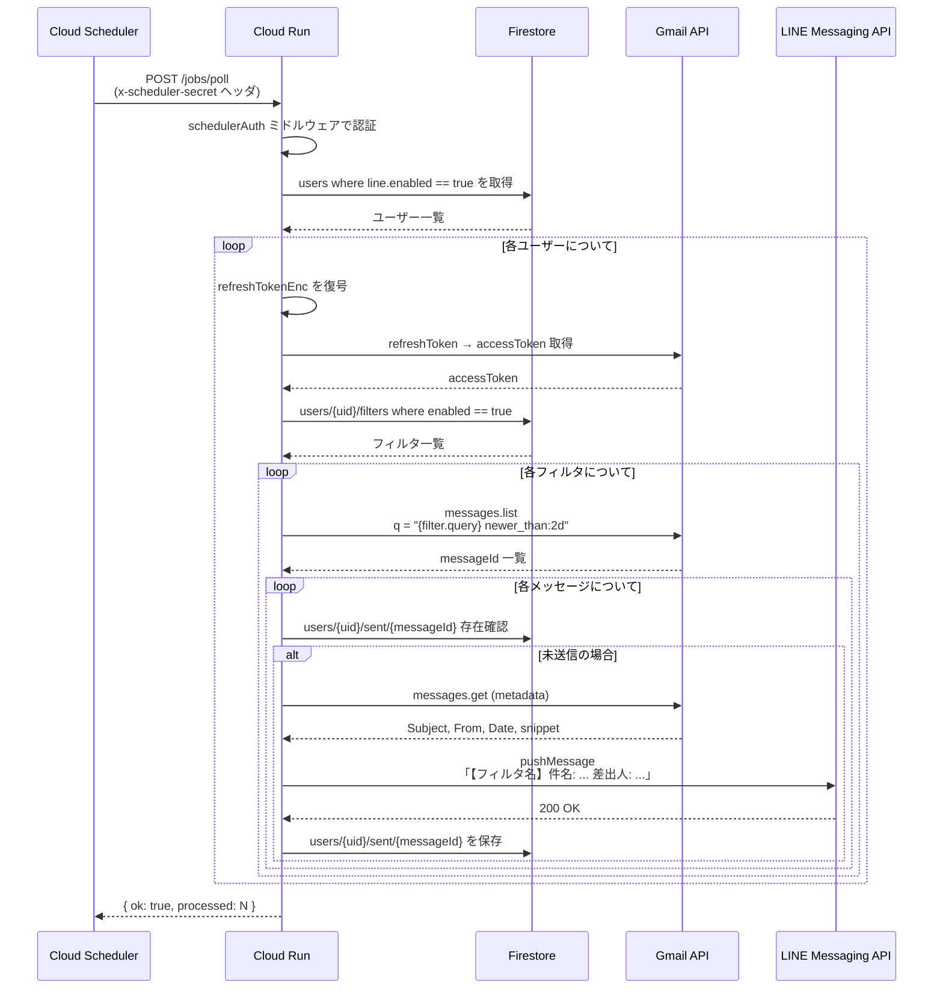
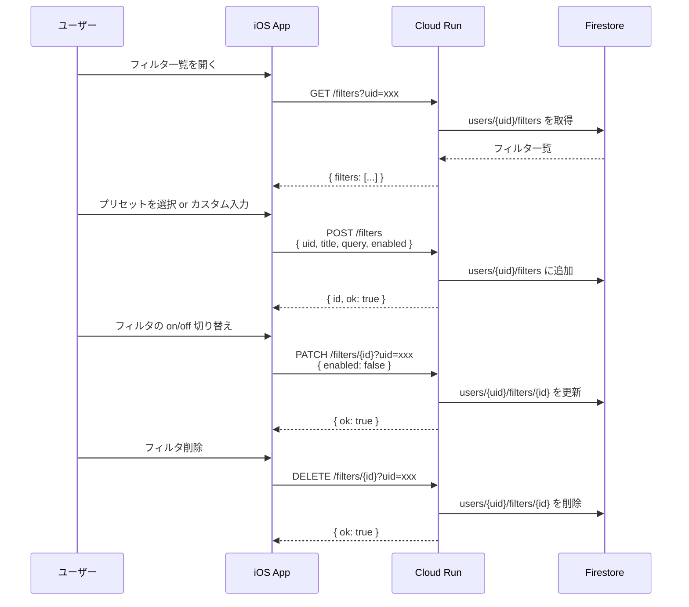

# アーキテクチャ仕様書

## 1. システム全体像

```
┌─────────────┐    HTTPS     ┌─────────────────────────────────────┐
│  iOS App    │─────────────▶│  Cloud Run  (Express / TypeScript)  │
│  (Expo)     │◀─────────────│                                     │
└─────────────┘              │  /auth/google      OAuth交換        │
                             │  /line/link/start   コード発行      │
                             │  /line/webhook      LINE受信        │
                             │  /filters           CRUD            │
                             │  /jobs/poll         ポーリング      │
                             └──┬──────┬──────┬──────┬─────────────┘
                                │      │      │      │
                   ┌────────────┘      │      │      └─────────────┐
                   ▼                   ▼      ▼                    ▼
            ┌────────────┐    ┌──────────┐ ┌──────────┐   ┌──────────────┐
            │ Firestore  │    │ Gmail    │ │ LINE     │   │ Cloud        │
            │ (DB)       │    │ API      │ │ Messaging│   │ Scheduler    │
            └────────────┘    └──────────┘ │ API      │   │ (cron)       │
                                           └──────────┘   └──────────────┘
```

### コンポーネント一覧

| コンポーネント | 役割 | 技術 |
|-------------|------|------|
| iOS App | ユーザー操作 (ログイン・連携・フィルタ設定) | Expo / React Native |
| Cloud Run | API サーバー + ジョブ実行 | Node.js 20 / Express / TypeScript |
| Firestore | ユーザー情報・フィルタ・送信履歴の永続化 | Google Cloud Firestore |
| Secret Manager | シークレット管理 (API キー・暗号鍵) | Google Cloud Secret Manager |
| Cloud Scheduler | 定期ポーリングトリガー | cron ジョブ → HTTP POST |
| Gmail API | メール検索 (OAuth2 / readonly) | Google APIs |
| LINE Messaging API | プッシュ通知・Webhook 受信 | LINE Bot SDK |

---

## 2. シーケンス図

### 2.1 Google OAuth 連携フロー



### 2.2 LINE 連携フロー（連携コード方式）



### 2.3 ポーリング（メール検出 → LINE 通知）フロー



### 2.4 フィルタ CRUD フロー



---

## 3. セキュリティ設計

### 3.1 トークン暗号化

```
暗号化方式: AES-256-GCM
鍵管理:    TOKEN_ENCRYPTION_KEY (base64, 32 bytes) → Secret Manager
保存形式:  base64( IV[12] + AuthTag[16] + Ciphertext )
```

- Gmail の refresh token は平文では Firestore に保存しない
- 暗号化鍵は Secret Manager で管理し、Cloud Run の環境変数として注入

### 3.2 エンドポイント保護

| エンドポイント | 保護方式 |
|-------------|---------|
| `/jobs/poll` | `x-scheduler-secret` ヘッダ or Cloud Run IAM 認証 |
| `/line/webhook` | LINE Platform からの HTTPS 呼び出し (将来: 署名検証追加) |
| `/auth/*`, `/filters/*` | uid ベース (将来: Firebase Auth / JWT 追加) |

### 3.3 Gmail API スコープ

`gmail.readonly` のみ使用。メールの送信・削除・変更は一切行わない。

---

## 4. 二重送信防止

```
1. Gmail API で messageId 一覧を取得
2. 各 messageId について sent/{messageId} の存在を確認
3. 存在しなければ LINE push → sent に記録
4. 存在すればスキップ
```

Firestore のドキュメント ID として Gmail messageId を使用するため、万が一の並行実行でも安全。

---

## 5. スケーラビリティ設計

### 現在 (MVP)

- Cloud Scheduler → 単一の `/jobs/poll` エンドポイント
- ユーザーを直列に処理

### 将来の拡張パス

| 段階 | 変更内容 |
|------|---------|
| **Phase 1** | `/jobs/poll` 内で `Promise.allSettled` による並列化 |
| **Phase 2** | Cloud Tasks に各ユーザーをキュー投入し Cloud Run がワーカーとして処理 |
| **Phase 3** | Gmail Push (users.watch + Pub/Sub + history.list) に移行しポーリング廃止 |

### Gmail Push 移行時の設計

```
Gmail users.watch API
    ↓ (変更通知)
Cloud Pub/Sub topic
    ↓ (push subscription)
Cloud Run /webhooks/gmail-push
    ↓
history.list で差分取得 → フィルタ照合 → LINE push
```

`/jobs/poll` と `/webhooks/gmail-push` を並行稼働させ、段階的に移行可能。

---

## 6. プラン設計

| 項目 | Free | Pro |
|------|------|-----|
| ポーリング間隔 | 15分 | 5分 |
| フィルタ数 | 3 | 無制限 |
| Gmail アカウント | 1 | 複数 |
| LINE 通知 | 月200件 | 無制限 |
