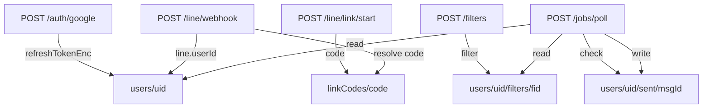

# Firestore スキーマ定義

## コレクション構造

```
firestore/
├── users/{uid}                          # ユーザー情報
│   ├── filters/{filterId}               # メール検索フィルタ
│   └── sent/{messageId}                 # 送信済みメッセージ (二重送信防止)
└── linkCodes/{code}                     # LINE 連携コード (一時データ)
```

---

## 1. users/{uid}

ユーザーのアカウント情報を管理するルートドキュメント。

| フィールド | 型 | 必須 | 説明 |
|-----------|------|------|------|
| `gmail.refreshTokenEnc` | string | Yes | AES-256-GCM で暗号化された Gmail refresh token |
| `gmail.accessTokenCache` | string | No | キャッシュ済み access token (将来利用) |
| `gmail.accessTokenExpiresAt` | timestamp | No | access token の有効期限 (将来利用) |
| `gmail.lastCheckedAt` | timestamp | Yes | 最後にポーリングを実行した日時 |
| `line.userId` | string | Yes | LINE Messaging API の userId |
| `line.enabled` | boolean | Yes | LINE 通知の有効/無効 |
| `plan` | string | Yes | `"free"` or `"pro"` |
| `createdAt` | timestamp | Yes | ドキュメント作成日時 |
| `updatedAt` | timestamp | Yes | 最終更新日時 |

**ドキュメント例**
```json
{
  "gmail": {
    "refreshTokenEnc": "base64-encoded-encrypted-token...",
    "lastCheckedAt": "2026-02-12T10:00:00Z"
  },
  "line": {
    "userId": "U1234567890abcdef...",
    "enabled": true
  },
  "plan": "free",
  "createdAt": "2026-02-12T09:00:00Z",
  "updatedAt": "2026-02-12T10:00:00Z"
}
```

**インデックス**

| フィールド | 方向 | 用途 |
|-----------|------|------|
| `line.enabled` | ASC | ポーリングジョブで対象ユーザーを抽出 |

---

## 2. users/{uid}/filters/{filterId}

Gmail 検索フィルタの定義。ユーザーごとにサブコレクションとして保持。

| フィールド | 型 | 必須 | 説明 |
|-----------|------|------|------|
| `title` | string | Yes | フィルタの表示名 |
| `query` | string | Yes | Gmail 検索クエリ |
| `enabled` | boolean | Yes | フィルタの有効/無効 |
| `createdAt` | timestamp | Yes | 作成日時 |
| `updatedAt` | timestamp | Yes | 最終更新日時 |

**ドキュメント例**
```json
{
  "title": "領収書・請求書",
  "query": "subject:(領収書 OR レシート OR 請求 OR 支払い OR ご利用明細)",
  "enabled": true,
  "createdAt": "2026-02-12T09:00:00Z",
  "updatedAt": "2026-02-12T09:00:00Z"
}
```

**インデックス**

| フィールド | 方向 | 用途 |
|-----------|------|------|
| `enabled` | ASC | ポーリングジョブで有効フィルタのみ取得 |
| `createdAt` | DESC | フィルタ一覧の降順表示 |

---

## 3. users/{uid}/sent/{messageId}

送信済みメッセージの記録。Gmail の messageId をドキュメント ID として使用し、二重送信を防止する。

| フィールド | 型 | 必須 | 説明 |
|-----------|------|------|------|
| `sentAt` | timestamp | Yes | LINE 送信日時 |
| `filterId` | string | Yes | マッチしたフィルタの ID |
| `hash` | string | No | 追加の重複検知用ハッシュ (将来利用) |

**ドキュメント例**
```json
{
  "sentAt": "2026-02-12T10:05:00Z",
  "filterId": "filter-abc123"
}
```

**ドキュメント ID の特性**

Gmail の messageId (例: `18d5a3b2c4e5f6g7`) をそのままドキュメント ID とするため:
- `sent.get(messageId)` の単一読み取りで存在確認可能
- Firestore のドキュメント ID ユニーク制約により自然に重複防止

---

## 4. linkCodes/{code}

LINE 連携用の一時コード。6桁の数字文字列をドキュメント ID とする。

| フィールド | 型 | 必須 | 説明 |
|-----------|------|------|------|
| `uid` | string | Yes | コード発行元のユーザー ID |
| `expiresAt` | timestamp | Yes | 有効期限 (発行から 10 分) |
| `used` | boolean | Yes | 使用済みフラグ |

**ドキュメント例**
```json
{
  "uid": "user-abc123",
  "expiresAt": "2026-02-12T10:10:00Z",
  "used": false
}
```

**ライフサイクル**
```
生成 → used: false, expiresAt: +10min
  ↓
使用 → used: true (webhook で解決時)
  ↓
(将来) TTL ポリシーで自動削除
```

---

## 5. データフロー図



---

## 6. セキュリティ考慮事項

| 項目 | 対策 |
|------|------|
| refresh token | AES-256-GCM で暗号化して保存。鍵は Secret Manager |
| LINE userId | 平文保存 (LINE Platform の仕様上、userId 単体では悪用不可) |
| linkCodes | 10 分で期限切れ + 1回使い切り。将来的に TTL で自動削除 |
| Firestore Rules | Cloud Run のサービスアカウントのみ読み書き可能に設定 |

---

## 7. 将来の拡張: TTL による自動クリーンアップ

Firestore の TTL ポリシーを設定することで、不要データを自動削除可能:

```bash
# linkCodes: expiresAt 以降に自動削除
gcloud firestore fields ttls update expiresAt \
  --collection-group=linkCodes

# sent: sentAt から 30 日後に自動削除
# (sent コレクションに ttlAt フィールドを追加する場合)
```
